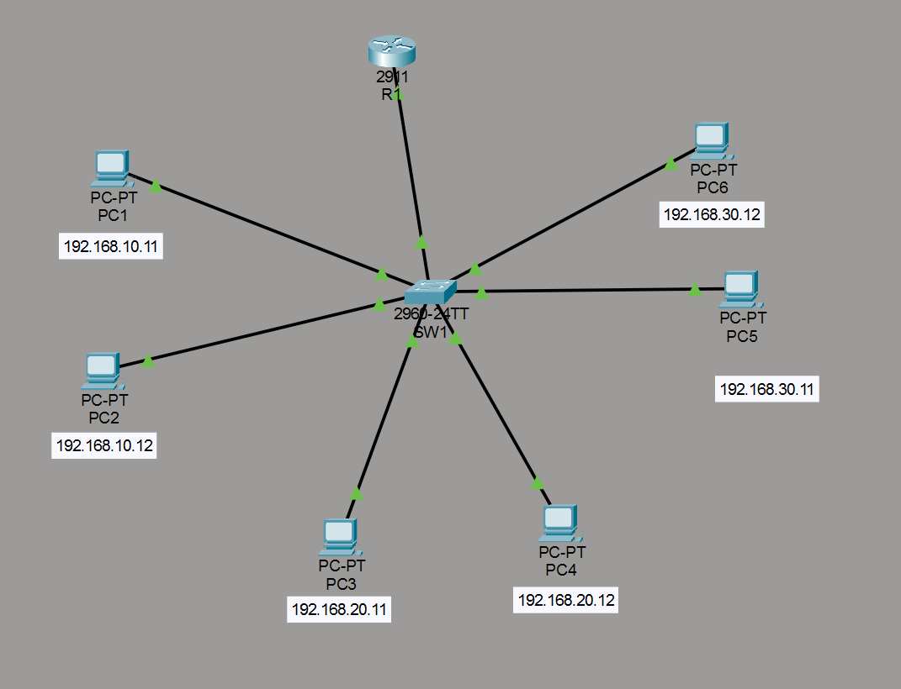
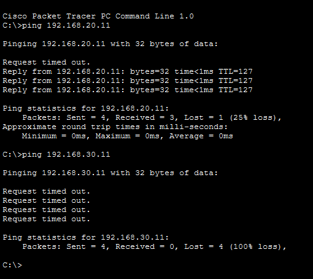
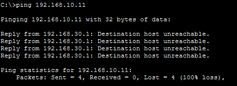

# Packet Tracer VLAN Lab

Small company network built in Cisco Packet Tracer: three VLANs, inter-VLAN routing, DHCP, and an ACL that isolates guests.

## Topology

One 2911 router (R1), one 2960 switch (SW1) and six PCs.

## Addressing

| VLAN | Name   | Subnet          | Gateway      | DHCP range            | Switch ports |
|------|--------|-----------------|--------------|-----------------------|--------------|
| 10   | STAFF  | 192.168.10.0/24 | 192.168.10.1 | 192.168.10.11 - .254  | Fa0/2-3      |
| 20   | IT     | 192.168.20.0/24 | 192.168.20.1 | 192.168.20.11 - .254  | Fa0/4-5      |
| 30   | GUESTS | 192.168.30.0/24 | 192.168.30.1 | 192.168.30.11 - .254  | Fa0/6-7      |

SW1 Fa0/1 is a trunk to R1 Gig0/0.

## What I built

- **VLANs and trunk:** A VLAN splits one physical switch into separate virtual networks, so Staff, IT and Guests are isolated from each other even though they share SW1. Ports Fa0/2 to Fa0/7 are access ports, each assigned to one VLAN. Fa0/1 is a trunk that carries all three VLANs to the router over a single cable, with each frame tagged using 802.1Q.
- **Inter-VLAN routing:** Separate VLANs can't communicate without a router. R1 uses router-on-a-stick: the physical port Gig0/0 is split into three sub-interfaces (Gig0/0.10, .20 and .30). Each one uses `encapsulation dot1Q` with its VLAN number and holds the gateway IP for that VLAN.
- **DHCP:** R1 is also the DHCP server, with one pool per VLAN. It automatically gives each PC an IP address, subnet mask and default gateway. The first ten addresses of each subnet are excluded, so the gateway address is never handed out.
- **ACL:** An extended ACL named `GUEST-IN` is applied inbound on Gig0/0.30. It denies traffic from the Guests network to the Staff and IT networks, then permits everything else, so guests can still reach their own gateway and each other.

## Tests

- A Staff PC can ping an IT PC (192.168.20.11). This proves inter-VLAN routing works: the traffic goes through R1, and the reply's TTL of 127 shows one router hop.
  
- A Guest PC cannot ping a Staff PC (192.168.10.11). It gets "Destination host unreachable" from 192.168.30.1, which proves the ACL on R1 blocks Guest traffic before it reaches Staff.
  

## Known limitation

The ACL only filters traffic entering from the Guests VLAN. When a Staff PC pings a Guest PC, the request gets through, but the Guest's reply enters R1 from VLAN 30 addressed to Staff and is denied by the ACL, so the ping times out. Guests are therefore isolated in both directions, not only outbound. A more precise ACL, or a stateful firewall, could allow only the replies to connections started from Staff.

## Files

- `vlan-lab.pkt`: the Packet Tracer file
- `R1-config.txt` and `SW1-config.txt`: running configs of R1 and SW1
- `topology.png`, `dhcp-binding.png`, `acl.png`, `ping-allowed.png`, `ping-blocked.png`: screenshots of the tests
